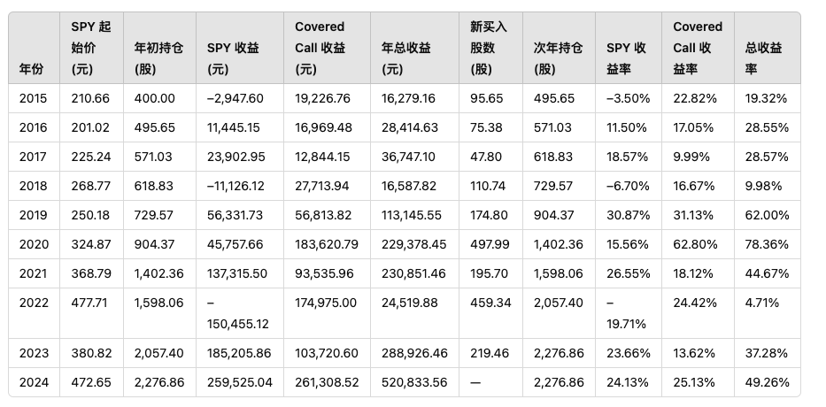

## 前言

人们都希望在年轻时实现财务自由，不必等到年老才退休。这种理念被称为 **FIRE（Financial Independence, Retire Early）运动**。但如果 **仅靠工作赚取薪资**，想要变得富有，对于 **99.9999...% 的人来说几乎是不可能的**。

让我们做一个简单的数学计算：

- 假设你大学毕业后开始工作，年薪 **税后 $60,000**，从 **22 岁工作到 40 岁**，总共赚取的工资为：

  $$60,000 \times 18 = 1.08M（108万美元）$$

- 如果你想在 30 岁时买一套像样的房子，房价 **$700,000**，贷款利息后总成本接近 **$1.4M（140万美元）**。

换句话说，即使你是 **1% 的高收入群体**，从 **毕业到 40 岁的所有收入**，也 **只能刚好买下一套房子**，更不用说日常开销、孩子教育、养老等其他生活成本。

所以，单靠工作赚钱，**想要变得富有几乎是不可能的**。

## 我的投资策略（2025）

### **市场现状分析**

当前市场正处于 **牛熊转换阶段**，表现如下：

- 小盘股 **大幅波动**
- **SPY** 已经 **横盘 4 个月**
- 未来 **可能回调至 200 日均线** 或 **直接下跌 20% 以上**

### **我的策略**

**Sell SPY Daily Covered Call 策略**

在持有 SPY 的同时，每日卖出 **covered call** 期权，以赚取额外收益。

- 每天开盘时卖出 SPY **比开盘价高 0.2% 的 covered call**。
- 收盘5分钟前, 如果SPY高于行权价, 我将回购期权

**2015-2024 收益分析**

